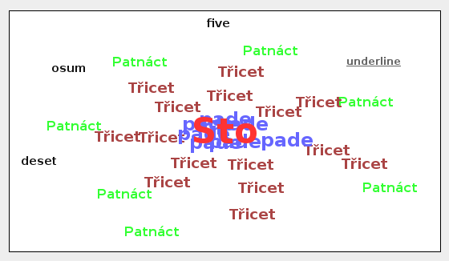
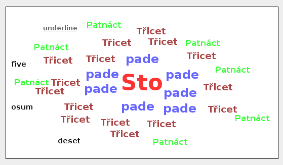
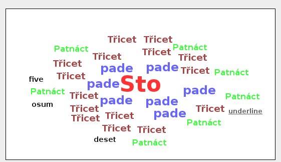
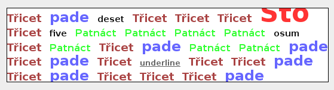

# dojo-word-cloud

This is a simple implementation of word cloud in [dojo toolkit](https://dojotoolkit.org/).

## Usage

See [example/index.html](example/index.html) and [example/js/app.js](example/js/app.js).

## Examples

Use [http://dstorejs.io/](dstore) for data: 
```js
 var words = [
		             {count:1, word:'<u>underline</u>', title: null},
		             {count:5, word:'five', title: null},
                 ...
		             {count:100, word:'Sto', title: null},
                 ...
		             {count:30, word:'Třicet', title: null}
 	    ];
	    var store = new Memory({data:words});
```

### Simple circled cloud

Very quick but not always so nice.

```js
	    var cloud = new Cloud({
	        store: store,
	        animation: 'translate',
	        height:300, // or null
	        positionFce: 'simpleCircle',
	        verticalChance: 0, // 0.0 ~ 1.0
	        shuffle: 0 // 1 or 0
	    });
	    cloud.placeAt('simpleCircle');
	    cloud.startup();
```



### Advanced circled cloud

Not so quick but nicer.

```js
	    var cloud = new Cloud({
	        store: store,
	        animation: 'translate',
	        height: 300,
	        positionFce: 'advancedCircle',
	        verticalChance: 0,
	        shuffle: 0 
	    });
	    cloud.placeAt('advancedCircle');
	    cloud.startup();
``` 



### Dense circled cloud

Slowest but nicest cloud.

```js
	    var cloud = new Cloud({
	        store: store,
	        animation: 'translate',
	        height: 300,
	        positionFce: 'denseCircle',
	        verticalChance: 0,
	        shuffle: 0
	    });
	    cloud.placeAt('denseCircle');
	    cloud.startup();
```



### Rows

```js
	    var cloud = new Cloud({
	        store:store,
	        positionFce:'rows'
	    });
      cloud.placeAt('rows');
      cloud.startup();
```



## Look

To change look, have a look at simple [wordcloud/css/wordcloud.css](wordcloud/css/wordcloud.css).

For rows cloud, you need to set appropriate size of the font.
